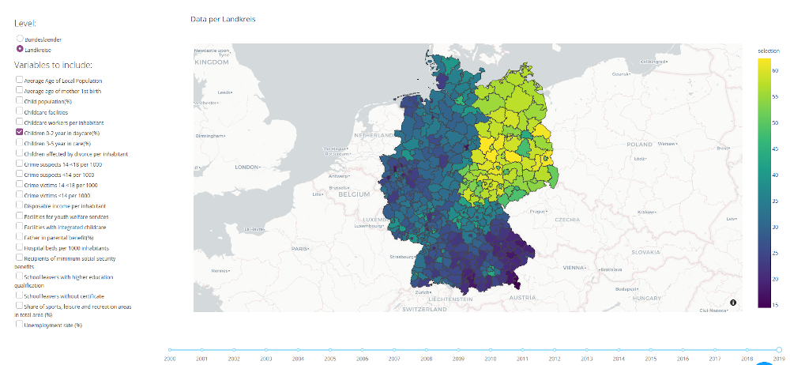
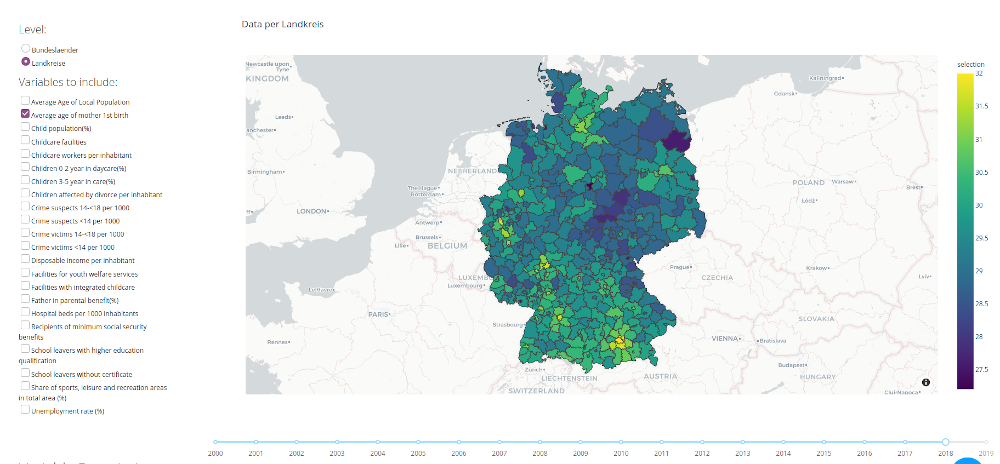
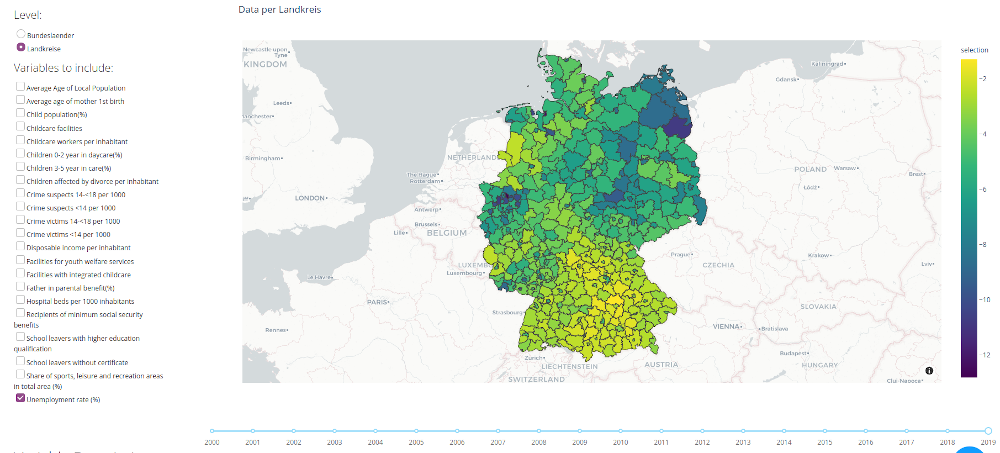

# Child Well-Being in Germany 

---

This project was conducted in the context of the [CorrelAid](https://correlaid.org/) local chapter challenge 
July - September 2020 by the [local chapter of Hamburg](https://correlaid.org/correlaid-x/hamburg/).

Contributors: 
Martin Wong, Vivika Wilde, Sarah Wenzel, Drenizë Rama, Long Nguyen, Trisha Nath, Christine Martens, 
Mauricio Malzer, Andre Kochanke, Eva Jaumann

---

Germany belongs to the rich countries, nevertheless this is not a guarantee that all children and adolescents
grow up in happiness. 

UNICEF studies [1,2] showed that even wealthy countries have room to improvement to ensure well-being for their youngest
citizens. There are many different factors which contribute to the well-being of a child, main categories according to UNICEF[2] are

* Material well-being
* Health and safety
* Educational well-being
* Family and peer relationships 
* Behaviours and risks
* Subjective well-being

To each category different metrics are used, so that it is challenging to calculate one single value which reports
the well-being of a country.

---

**NOTE**

Our goal of this project was not to calculate one single metric to evaluate happiness, but to raise awareness to
the topic and how many different factors influence children. Please check also our [notes](#notes-on-the-interactive-map).

---

With our visualisation we want to be able to show the difference in german regions on different factors which directly
or indirectly touch the life of young people. 

It is not only possible to look at regional differences, but also how the metrics evolved in the last years. You can discover
the factors you are mostly interested.

## Data

We used data from the [datenguide](https://github.com/CorrelAid/datenguide-python), which is a package to easily
access German publicly available [regional statistics](https://www.regionalstatistik.de/genesis/online/logon). 
In addition, [German police crime statistics](https://www.bka.de/DE/AktuelleInformationen/StatistikenLagebilder/PolizeilicheKriminalstatistik/pks_node.html)
were used.

Data are on NUTS-3 level. "Germany's NUTS-3 regions are generally districts known as Kreise or as kreisfreie Städte." [3]

## Visualisation

The map shows different, selectable factors on either state or nuts-3 level. The interactive map was build as a dash application.
If you don't see a result, data are missing for this factor and this year.

Please have a look at the [video](https://www.awesomescreenshot.com/video/910729?key=ec527c8315a26c4d3ce8a8a85a35de47) to
see how the visualisation looks like.

Following screenshots give a first impression:

### Daycare 0-2 years (2019)
The indicator shows percentage of children (0-2 years) having daycare facilities of total children of same age group.

It is interesting to see the differences between west and east Germany even 30 years after the fall
of the Berlin wall. These are still caused by a different development of child care in the different
political systems.[4]

### Age of mother 1st child 2018
The indicator shows average age of mother at giving birth of the first child.

This figure indicates that mothers in cities as Munich or Frankfurt are older than mothers in rural
areas when giving birth to their first child. A study[5] came to the conclusion, that mothers who are younger
than 25 have a lower lifetime income of more than two years of annual labor income. Therefore, it is
also a financial aspect for the child's well-being indirectly.

### Unemployment 2019

Unemployed persons as a share of the civilian labor force averaged over the year. 

Another material aspect shows the unemployment rate, as money is a key to access to education, 
culture and more. 

These were some examples to illustrate the map, there are more insights hidden!

## References

[1] https://www.unicef-irc.org/publications/pdf/Report-Card-16-Worlds-of-Influence-child-wellbeing.pdf (last accessed 2020-09-09)

[2] https://www.unicef.org/media/files/ChildPovertyReport.pdf (last accessed 2020-09-09)

[3] https://www.destatis.de/Europa/EN/Methods/Classifications/OverviewClassification_NUTS.html (last accessed 2020-09-09)

[4] https://www.dji.de/fileadmin/user_upload/bibs2018/WEB_DJI_ExpertiseDeutschland.pdf (last accessed 2020-09-09)

[5] https://www.ncbi.nlm.nih.gov/pmc/articles/PMC4723246/ (last accessed 2020-09-09)

COVID-19 and children mental health: https://www.weforum.org/agenda/2020/05/covid-19-is-hurting-childrens-mental-health (last accessed 2020-09-09)

# Notes on the interactive map

- The interactive map displays a standardized and normalized average across all features selected via the checkboxes
- Features include information with some relation to child well-being and are intended to be selected according to the user's specific information interest
- The combination of features is up to the user and the interpretation needs to be made with caution. The data has not been weighted and some factors may be over-, under- or misrepresented
- Features like "population" are included for illustration purposes, even though they are not directly linked to child well-being

# Instructions for running the interactive map (dash app)

- Requirements: python 3.8 and [datenguide python package](https://github.com/CorrelAid/datenguide-python) have to 
be installed

- Clone the repository to your local file system
- Set up an environment based on the included .yml file (e.g. by importing it to Anaconda or manually installing the libraries listed in the requirements file)
- Run the Dash_Map.py file in the terminal or via any IDE (e.g PyCharm) 
In case of errors please check if python 3.8 is used, as it is not working with versions below
- Open the web application via the provided localhost URL (e.g. http://127.0.0.1:8050/)

To add new datasets to the map: Place the file in pickle format in the folder "data_pickles" and the app will include it in the next run
